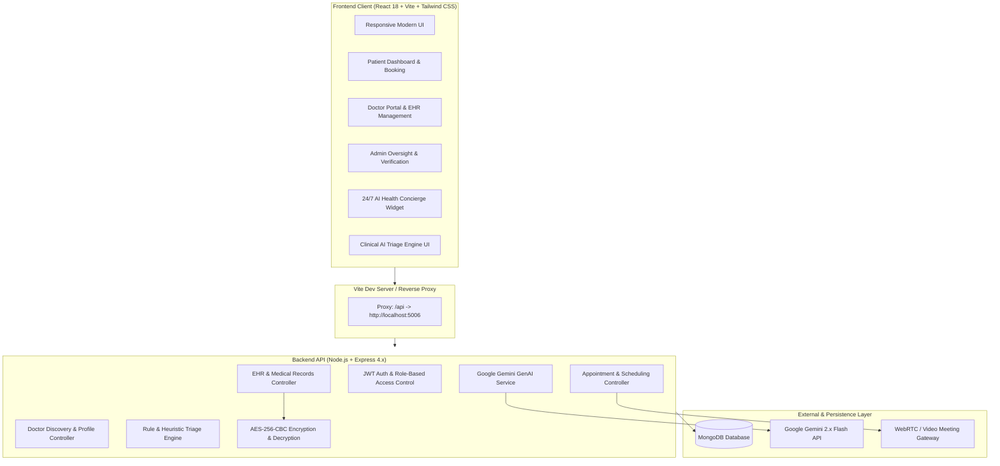

# 🏥 Smart HealthSphere — Intelligent Healthcare & Telemedicine Platform

> **Next-Generation Clinical Management, AI Symptom Triage, Encrypted EHR Vault & Telemedicine Platform**

[](https://reactjs.org/)
[](https://vitejs.dev/)
[](https://nodejs.org/)
[](https://expressjs.com/)
[](https://www.mongodb.com/)
[](https://ai.google.dev/)
[](#security--cryptography)
[](https://tailwindcss.com/)

---

## 📌 Executive Summary

**Smart HealthSphere** is a full-stack, enterprise-grade digital healthcare platform engineered to bridge patients, certified medical practitioners, and hospital administrators. It incorporates intelligent AI-driven clinical triage, a 24/7 Google Gemini conversational health concierge with live doctor database context, AES-256-CBC encrypted electronic health records (EHR), 1-click WebRTC telemedicine video consultations, and end-to-end appointment lifecycle management.

---

## 🏗️ System Architecture



---

## 🌟 Key Features by User Role

### 🧑‍⚕️ 1. Patient Experience
* **Interactive Specialist Discovery:** Search, filter, and sort vetted doctors by specialty (Cardiology, Neurology, Pediatrics, Dermatology, Orthopedics, etc.), consultation fees, and experience.
* **Instant Appointment Booking:** Select available doctor slots, provide visit reason, and track status (`pending`, `confirmed`, `completed`, `cancelled`).
* **AI Clinical Symptom Triage:** Interactive self-assessment tool evaluating symptom severity, age, and duration to generate risk scores (Low, Moderate, High Risk) and automatically suggest the relevant medical specialty.
* **24/7 AI Health Concierge:** Powered by Google's `@google/genai` Gemini SDK. Dynamically pulls live platform doctors into its prompt context to provide accurate answers, platform guidance, and urgent emergency safety alerts.
* **Encrypted Medical Records Vault:** Access personal prescriptions, clinical evaluations, and lab results encrypted at rest with AES-256-CBC.
* **1-Click Telemedicine:** Launch secure video consultations directly from the appointment dashboard.

### 🩺 2. Doctor Portal
* **Practitioner Dashboard:** Overview of total appointments, upcoming schedule, active patients, and pending booking approvals.
* **Appointment Lifecycle Control:** Confirm patient requests, mark visits as completed, or provide cancellation notices.
* **E-Prescription & EHR Management:** Issue clinical evaluations, update vitals (blood pressure, heart rate, temperature), attach prescriptions, and store them securely with automatic AES-256 encryption.
* **Flexible Availability Scheduling:** Configure recurring weekly consultation hours and day-by-day availability slots.

### 🛡️ 3. Administrator Control Center
* **System-Wide Analytics:** Live metrics tracking registered patients, total appointments, active physicians, and pending verifications.
* **Doctor Verification Workflow:** Review doctor credentials, qualifications, consultation rates, and toggle approval (`isApproved: true/false`). Only approved doctors appear in patient searches.
* **User Management:** Full administrative oversight over platform accounts with account status management.
* **Platform Appointment Oversight:** Monitor all clinic appointments across all departments.

---

## 🤖 AI & Clinical Intelligence

### 1. HealthSphere AI Concierge (`gemini.service.js`)
* **SDK:** `@google/genai` (Google GenAI SDK)
* **Live Database Context:** Automatically injects approved doctors, their specialties, consultation fees, and patient metadata into the model prompt.
* **Strict Guardrails:** Restricts conversations to health education and platform features; strictly declines non-medical topics (coding, politics, trivia).
* **Emergency Safety Directives:** Automatically identifies life-threatening keywords (chest pain, stroke, severe breathing difficulty) and directs patients to emergency services (911/112).
* **Graceful Local Fallback:** Functions intelligently even if a `GEMINI_API_KEY` is not supplied.

### 2. Clinical Symptom Triage Engine (`triage.service.js`)
* Heuristic symptom matcher mapping symptoms against clinical risk levels:
  * **Cardiology:** High Risk (Chest pain, palpitations, shortness of breath, angina)
  * **Neurology:** High Risk (Migraines, dizziness, seizures, numbness, facial drooping)
  * **Orthopedics:** Moderate Risk (Joint pain, fractures, spine discomfort)
  * **Pediatrics:** Moderate Risk (Child wellness, infant fever)
  * **Dermatology & General Medicine:** Low / Moderate Risk (Skin lesions, fever, fatigue)
* Computes numerical `riskScore` (0–100) and outputs emergency warning flags when red-flag conditions are met.

---

## 🔒 Security & Cryptography

* **AES-256-CBC Medical Record Encryption:**
  * Sensitive diagnosis details, prescriptions, and physician notes are encrypted using standard `aes-256-cbc`.
  * Every record generates a unique cryptographically secure 16-byte Initialization Vector (`iv`).
  * 256-bit secret key is derived via SHA-256 hashing of `JWT_SECRET`.
* **Stateless JWT Authentication:** Secure bearer token authorization on all protected API endpoints.
* **Role-Based Access Control (RBAC):** `protect`, `doctorOnly`, and `adminOnly` route middleware verifying user roles before executing controller logic.
* **Password Hashing:** Passwords hashed with `bcryptjs` (salt rounds: 10).
* **Cross-Origin Security & Protection:** Configured with `cors()`, `cookie-parser`, and JSON payload sanitization.

---

## 📁 Repository Directory Structure

```text
doctor-healthcare-system/
├── backend/
│   ├── src/
│   │   ├── config/
│   │   │   └── db.js                        # MongoDB connection handler
│   │   ├── controllers/
│   │   │   ├── admin.controller.js          # Admin dashboard & verification logic
│   │   │   ├── aiChat.controller.js         # Gemini conversational chatbot controller
│   │   │   ├── appointment.controller.js    # Booking & scheduling lifecycle
│   │   │   ├── auth.controller.js           # Registration, login & profile
│   │   │   ├── doctor.controller.js         # Doctor directory & profile updates
│   │   │   ├── medicalRecord.controller.js  # EHR creation, encryption & retrieval
│   │   │   ├── notification.controller.js   # In-app alerts & notifications
│   │   │   ├── review.controller.js         # Doctor ratings & feedback
│   │   │   └── triage.controller.js         # Symptom assessment controller
│   │   ├── middleware/
│   │   │   ├── auth.middleware.js           # JWT verification & role authorization
│   │   │   └── upload.middleware.js         # Multer attachment handler
│   │   ├── models/
│   │   │   ├── Appointment.js               # Appointment schema & triage metadata
│   │   │   ├── DoctorProfile.js             # Detailed doctor credentials
│   │   │   ├── MedicalRecord.js             # EHR schema with AES-256 fields
│   │   │   ├── Notification.js              # Notification schema
│   │   │   ├── Review.js                    # Review schema
│   │   │   └── User.js                      # User schema with bcrypt hooks
│   │   ├── routes/
│   │   │   ├── admin.routes.js              # /api/admin
│   │   │   ├── aiChat.routes.js             # /api/ai-chat
│   │   │   ├── appointment.routes.js        # /api/appointments
│   │   │   ├── auth.routes.js               # /api/auth
│   │   │   ├── doctor.routes.js             # /api/doctors
│   │   │   ├── medicalRecord.routes.js      # /api/medical-records
│   │   │   ├── notification.routes.js       # /api/notifications
│   │   │   ├── review.routes.js             # /api/reviews
│   │   │   └── triage.routes.js             # /api/triage
│   │   ├── services/
│   │   │   ├── appointmentReminder.service.js # Scheduled reminders
│   │   │   ├── gemini.service.js            # Google GenAI integration
│   │   │   └── triage.service.js            # Clinical triage scoring logic
│   │   ├── utils/
│   │   │   ├── encryption.util.js           # AES-256-CBC cipher & decipher
│   │   │   ├── ApiError.js                  # Standardized error class
│   │   │   ├── ApiResponse.js               # Standardized API response formatter
│   │   │   └── asyncHandler.js              # Async wrapper for Express routes
│   │   ├── app.js                           # Express application setup
│   │   └── server.js                        # HTTP server & graceful shutdown
│   ├── .env.example                         # Backend environment template
│   └── package.json
│
├── frontend/
│   ├── src/
│   │   ├── api/
│   │   │   └── axios.js                     # Configured Axios with Bearer interceptors
│   │   ├── components/
│   │   │   ├── chat/
│   │   │   │   └── HealthConciergeBot.jsx   # Floating 24/7 AI chat assistant
│   │   │   ├── layout/
│   │   │   │   ├── DashboardLayout.jsx      # Portal dashboard sidebar & navbar wrapper
│   │   │   │   ├── Navbar.jsx               # Navigation bar
│   │   │   │   └── Sidebar.jsx              # Role-specific navigation drawer
│   │   │   └── triage/
│   │   │       └── AITriageModal.jsx        # Interactive symptom analysis dialog
│   │   ├── pages/
│   │   │   ├── admin/
│   │   │   │   ├── AdminDashboard.jsx       # Platform analytics & overview
│   │   │   │   ├── ManageAppointments.jsx   # Global appointment monitor
│   │   │   │   ├── ManageDoctors.jsx        # Doctor vetting & approval UI
│   │   │   │   └── ManageUsers.jsx          # User accounts management
│   │   │   ├── auth/
│   │   │   │   ├── Login.jsx                # Secure login screen
│   │   │   │   └── Register.jsx             # Role-based onboarding screen
│   │   │   ├── doctor/
│   │   │   │   ├── Availability.jsx         # Shift & slot management
│   │   │   │   ├── DoctorAppointments.jsx   # Consultation management
│   │   │   │   ├── DoctorDashboard.jsx      # Doctor overview & metrics
│   │   │   │   └── PatientRecords.jsx       # EHR authoring & prescription vault
│   │   │   ├── patient/
│   │   │   │   ├── Doctors.jsx              # Specialist search view
│   │   │   │   ├── MedicalRecords.jsx       # Patient EHR viewer
│   │   │   │   ├── MyAppointments.jsx       # Appointments tracker & video launcher
│   │   │   │   └── PatientDashboard.jsx     # Patient overview & quick actions
│   │   │   ├── DoctorsList.jsx              # Public & protected doctor directory
│   │   │   └── Home.jsx                     # Landing page with triage CTA
│   │   ├── routes/
│   │   │   └── AppRoutes.jsx                # React Router v6 routing map
│   │   ├── App.jsx
│   │   ├── index.css                        # Tailwind CSS styles
│   │   └── main.jsx                         # React root entrypoint
│   ├── vite.config.js                       # Vite configuration with /api reverse proxy
│   ├── tailwind.config.js                   # Tailwind design system configuration
│   └── package.json
└── README.md
```

---

## 🔌 API Reference Guide

### 🔐 Authentication (`/api/auth`)
| Method | Endpoint | Access | Description |
| :--- | :--- | :--- | :--- |
| `POST` | `/api/auth/register` | Public | Register a new user (`patient`, `doctor`, or `admin`) |
| `POST` | `/api/auth/login` | Public | Authenticate user & return JWT token |
| `GET` | `/api/auth/profile` | Protected | Fetch authenticated user's profile |
| `PUT` | `/api/auth/profile` | Protected | Update profile details |

### 👨‍⚕️ Doctors (`/api/doctors`)
| Method | Endpoint | Access | Description |
| :--- | :--- | :--- | :--- |
| `GET` | `/api/doctors` | Public | List all approved physicians (supports specialty filters) |
| `GET` | `/api/doctors/:id` | Public | Get single doctor details, fee, and availability |
| `PUT` | `/api/doctors/availability` | Doctor | Update weekly consultation schedule |

### 📅 Appointments (`/api/appointments`)
| Method | Endpoint | Access | Description |
| :--- | :--- | :--- | :--- |
| `POST` | `/api/appointments` | Patient | Book a new consultation slot with triage metadata |
| `GET` | `/api/appointments/my` | Protected | Retrieve user's appointments (Patient or Doctor) |
| `PUT` | `/api/appointments/:id/status`| Doctor/Admin | Update status (`confirmed`, `completed`, `cancelled`) |
| `PUT` | `/api/appointments/:id/telemedicine`| Doctor | Assign WebRTC telemedicine room URL |

### 📁 Medical Records / EHR (`/api/medical-records`)
| Method | Endpoint | Access | Description |
| :--- | :--- | :--- | :--- |
| `POST` | `/api/medical-records` | Doctor | Create and AES-256 encrypt clinical note / prescription |
| `GET` | `/api/medical-records/patient/:id` | Doctor/Admin | Retrieve decrypted patient medical records |
| `GET` | `/api/medical-records/my-records` | Patient | Retrieve authenticated patient's decrypted health records |

### 🤖 AI Triage & Concierge (`/api/triage` & `/api/ai-chat`)
| Method | Endpoint | Access | Description |
| :--- | :--- | :--- | :--- |
| `POST` | `/api/triage/assess` | Public/User | Run clinical symptom assessment & risk scoring |
| `POST` | `/api/ai-chat` | Public/User | Converse with Google Gemini Health Concierge |

### 🛡️ Admin (`/api/admin`)
| Method | Endpoint | Access | Description |
| :--- | :--- | :--- | :--- |
| `GET` | `/api/admin/dashboard` | Admin Only | Platform-wide operational analytics |
| `GET` | `/api/admin/doctors` | Admin Only | List all doctor applications |
| `PUT` | `/api/admin/doctors/:id/approval`| Admin Only | Approve or reject doctor credentials |
| `GET` | `/api/admin/users` | Admin Only | List and manage platform user accounts |

---

## 🛠️ Installation & Local Setup

### Prerequisites
* **Node.js**: `v18.0.0` or higher
* **npm**: `v9.0.0` or higher
* **MongoDB**: Local MongoDB instance (`mongodb://127.0.0.1:27017`) or MongoDB Atlas URI

### 1. Clone the Repository
```bash
git clone https://github.com/WackyAditya/Smart-HealthSphere.git
cd Smart-HealthSphere
```

---

### 2. Configure Backend Environment
Navigate to the `backend/` directory:
```bash
cd backend
npm install
```

Create a `.env` file based on `.env.example`:
```env
PORT=5006
MONGO_URI=mongodb://127.0.0.1:27017/doctorApp
JWT_SECRET=supersecrethealthcare2026
GEMINI_API_KEY=your_gemini_api_key_here
```
> *Note: If `GEMINI_API_KEY` is not provided, the Health Concierge seamlessly falls back to a curated local medical guidance mode.*

---

### 3. Configure Frontend Environment
In a new terminal window, navigate to the `frontend/` directory:
```bash
cd frontend
npm install
```

Create a `.env` file based on `.env.example`:
```env
VITE_API_URL=/api
```
*(The Vite dev server automatically proxies `/api` requests to `http://localhost:5006` via `vite.config.js`)*.

---

### 4. Running the Development Servers

#### Terminal 1 — Backend:
```bash
cd backend
npm run dev
```
Server will start on `http://localhost:5006`.

#### Terminal 2 — Frontend:
```bash
cd frontend
npm run dev
```
Frontend application will launch on `http://localhost:5173`.

---

## 👥 Default Roles & Getting Started

1. **Patient Account:**
   * Register on the platform with the **Patient** role.
   * Explore the homepage symptom triage, browse vetted doctors, book an appointment, and talk to the 24/7 AI concierge.
2. **Doctor Account:**
   * Register with the **Doctor** role, specifying your medical specialty, consultation fees, and experience.
   * *Note:* New doctor accounts require administrative verification before appearing in search listings.
3. **Administrator Account:**
   * Register with the **Admin** role or seed your first admin in MongoDB.
   * Navigate to `/admin/doctors` to review pending doctor profiles and approve their licenses.

---

## 🚀 Deployment Guide

### Backend (Render / Railway / AWS EC2)
* **Build Command:** `npm install`
* **Start Command:** `npm start`
* **Required Environment Variables:**
  * `NODE_ENV=production`
  * `PORT=5000` (or host-assigned port)
  * `MONGO_URI=mongodb+srv://<username>:<password>@cluster.mongodb.net/smarthealth`
  * `JWT_SECRET=your_production_jwt_secret`
  * `GEMINI_API_KEY=your_production_gemini_key`

### Frontend (Vercel / Netlify / Cloudflare Pages)
* **Build Command:** `npm run build`
* **Output Directory:** `dist`
* **Required Environment Variable:**
  * `VITE_API_URL=https://your-backend-api-domain.com/api`

---

## 📄 License & Compliance Notice

This project is developed for educational and clinical management demonstration purposes. For production deployments handling Protected Health Information (PHI), ensure complete compliance review under **HIPAA (Health Insurance Portability and Accountability Act)** and **GDPR**, along with business associate agreements (BAA) with third-party cloud and AI providers.
